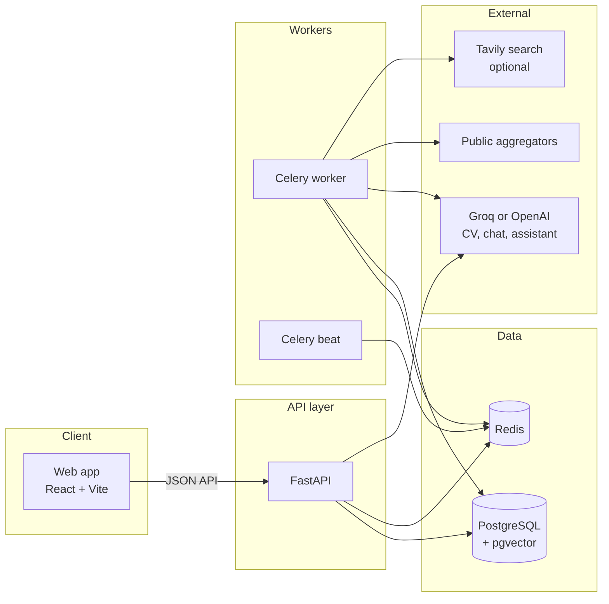

# Career Intelligence Platform

A personal companion for ambitious students and early-career professionals who need to find the right scholarships, fellowships, and similar opportunities — then understand why they fit, and actually follow through.

The product is built around one idea: **your profile should drive discovery, ranking, and next steps**, instead of a generic feed of every listing on the internet.

---

## Who it is for

- Students planning graduate study, research internships, or funded programmes
- Early-career researchers and professionals targeting scholarships and fellowships
- Anyone who currently tracks opportunities across many websites, spreadsheets, and deadlines

It is a **personal** system. Each account has its own profile, matches, saved items, and application status.

---


## What problem it solves

Opportunity hunting is noisy. Aggregator sites mix open calls with blog posts. Deadlines hide in RSS feeds. Fit is usually a gut feeling.

This platform:

1. **Learns who you are** from a structured intake form and your CV
2. **Collects listings** from a curated set of aggregators
3. **Filters noise** so editorial pages and closed calls drop out
4. **Scores each remaining opportunity** against your profile, with reasons you can read
5. **Helps you act** — save, apply, dismiss, export a deadline, ask a question

---


## What you can do


### For every user


| Area                    | What you get                                                                                                                                    |
| ----------------------- | ----------------------------------------------------------------------------------------------------------------------------------------------- |
| **Profile setup**       | A guided form (about you, CV, education, goals, preferences). A CV upload is parsed into structured fields and merged with what you typed.      |
| **Ranked dashboard**    | Matches ordered by fit. Each card shows a fit level (strong / moderate / exploring), a score breakdown, and short reasons tied to your profile. |
| **Trust labels**        | A badge that says whether a listing was confirmed on an official page, seen only on an aggregator, not checked yet, or in conflict.             |
| **Deadlines**           | “Closing soon” highlights, deadline chips, and one-click export to a calendar file or Google Calendar.                                          |
| **Status tracking**     | Save, mark as applied, or dismiss (with a reason). Those choices later influence affinity scoring.                                              |
| **Ask about a listing** | Question answering grounded in the stored opportunity text, plus an assistant that can look things up and propose checklist items.              |
| **Notifications**       | In-app reminders for new strong matches and upcoming deadlines. Email is available when you configure it.                                       |


### For administrators

Administrators also get tools to run the system:

- **Sources** — active feeds, health, and candidate sources suggested by discovery
- **Ingestion** — fetch and inspect the pipeline that turns web listings into cards
- **Ingestion lab** — try a single aggregator’s discover/extract path without waiting for the hourly job
- **Background tasks** — hourly ingest, daily re-ranking, daily notifications, weekly staleness checks

---


## How a typical journey works

```text
Create account
    → Complete profile setup (form + CV)
        → System builds a structured profile and matching rules
            → Sources are selected and listings are fetched
                → Relevance gate drops noise
                    → Each listing is scored against you
                        → Dashboard shows ranked cards
                            → You save, apply, dismiss, or ask a question
```

Profile setup is the switch that turns a blank dashboard into a personal feed. Until it is finished, the app still works — it just has nothing tailored to rank.

---


## How matching works

Fit is not a single opaque number. Each opportunity is scored from four parts:


| Part            | Weight | Meaning                                                            |
| --------------- | ------ | ------------------------------------------------------------------ |
| **Semantic**    | 45%    | How close the listing text is to your interests, skills, and goals |
| **Eligibility** | 30%    | Degree level, region, funding, and other rules from your profile   |
| **Urgency**     | 15%    | How soon the deadline is (missing deadlines score zero here)       |
| **Affinity**    | 10%    | Similarity to items you already saved or dismissed                 |


The result is labelled **strong**, **moderate**, or **exploring**, and the card shows the reasons — for example a matching research interest, a region mismatch, or a deadline in three days.

Semantic scoring prefers cloud embeddings when an API key is present. If not, it falls back to a local embedding model, then to plain text overlap, so ranking still runs.

---


## How listings are collected

A git-tracked **source registry** lists public aggregators (RSS feeds, WordPress APIs, sitemaps, and similar). After you activate a profile, the system:

1. **Discovers** items from those sources
2. Runs a **relevance gate** that admits a single applyable opportunity, rejects hubs and boilerplate, or marks thin items for a closer look
3. **Stores** the ones that pass, with enough text to rank and explain
4. Optionally **verifies** key facts against an official page (this is stronger when web search is configured)
5. Re-checks old URLs on a weekly cadence so stale calls fade out of the default feed

You do not have to manage this by hand. An hourly background job keeps sources in sync. Completing profile setup also queues a first ingest for that user.

---


## Architecture

The system is a small set of services that you run together with Docker Compose.




**Request path.** The browser talks to the React app. The app calls the FastAPI backend. Postgres stores users, profiles, opportunities, scores, and verification results. Redis is the job queue.

**Background path.** Celery beat reads schedules from the database and enqueues work. Workers fetch sources, rank users, send notifications, verify listings, and run the profile pipeline after someone submits setup.

**Intelligence path.** Groq (or OpenAI) reads CVs and powers chat. Embeddings support ranking and retrieval-augmented answers. Tavily is optional and used when the system needs to search the public web.

```text
Browser  →  React (port 5173)
                →  FastAPI (port 8000)
                      ↳  PostgreSQL + pgvector (port 5432)
                      ↳  Redis (port 6379)
                      ↳  Celery workers
                            ↳ ingest · rank · notify · verify · profile pipeline
```


### Main building blocks


| Piece                  | Role                                                                                              |
| ---------------------- | ------------------------------------------------------------------------------------------------- |
| **Profile pipeline**   | Prefill from the form → CV extraction → merge/repair → compile rules → activate sources → ingest  |
| **Ingestion pipeline** | Discover → relevance gate → extract/canonicalize → store → rank                                   |
| **Verification layer** | Compare aggregator claims with an official page; expose a trust badge on each card                |
| **Ranking service**    | Composite fit score and human-readable reasons                                                    |
| **RAG + assistant**    | Retrieve stored opportunity text, answer questions, optional tools (search, fetch URL, checklist) |
| **Auth**               | Register / login with a JWT. First launch can create a bootstrap administrator                    |


---


## Technology


| Layer      | Choice                                                        |
| ---------- | ------------------------------------------------------------- |
| Website    | React 18, TypeScript, Vite, TanStack Query                    |
| API        | Python 3.12, FastAPI, SQLAlchemy, Alembic                     |
| Database   | PostgreSQL 16 with pgvector                                   |
| Jobs       | Celery, Redis, database-backed beat schedule                  |
| LLM        | Groq by default (OpenAI-compatible); OpenAI as an alternative |
| Embeddings | OpenAI, Gemini, or local FastEmbed, with lexical fallback     |
| Packaging  | Docker Compose for local use                                  |


---


## Project layout

```text
career_intelligence_platform/
├── frontend/          Website (React + Vite)
├── backend/           API, workers, ranking, ingestion, tests
├── config/sources/    Aggregator registry and relevance settings
├── infra/             Database init (pgvector) and deploy config
├── setup.md           Step-by-step local setup
└── docker-compose.yml One command to run the full stack
```

---


## Getting started

Local install, API keys, first sign-in, and a working checklist are in **[setup.md](setup.md)**.

The short version, once Docker is installed:

```bash
cp .env.example .env
# Add GROQ_API_KEY (and change SECRET_KEY / admin password)

docker compose up --build
```

Then open [http://localhost:5173](http://localhost:5173) and sign in. Interactive API docs live at [http://localhost:8000/docs](http://localhost:8000/docs).

A Groq API key is required for CV extraction, chat, and the assistant. The rest of the stack runs without it. Details, optional keys (OpenAI, Tavily, email, LangSmith), and troubleshooting are all in the setup guide.

---

